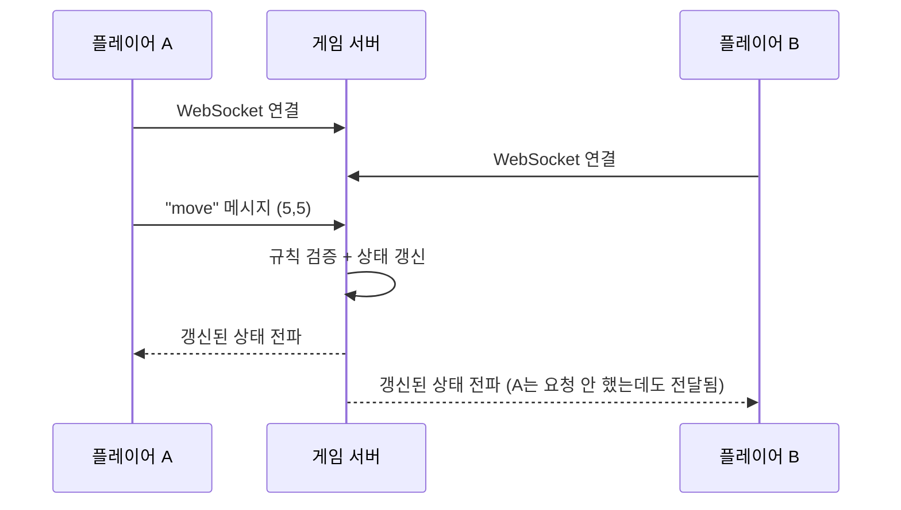
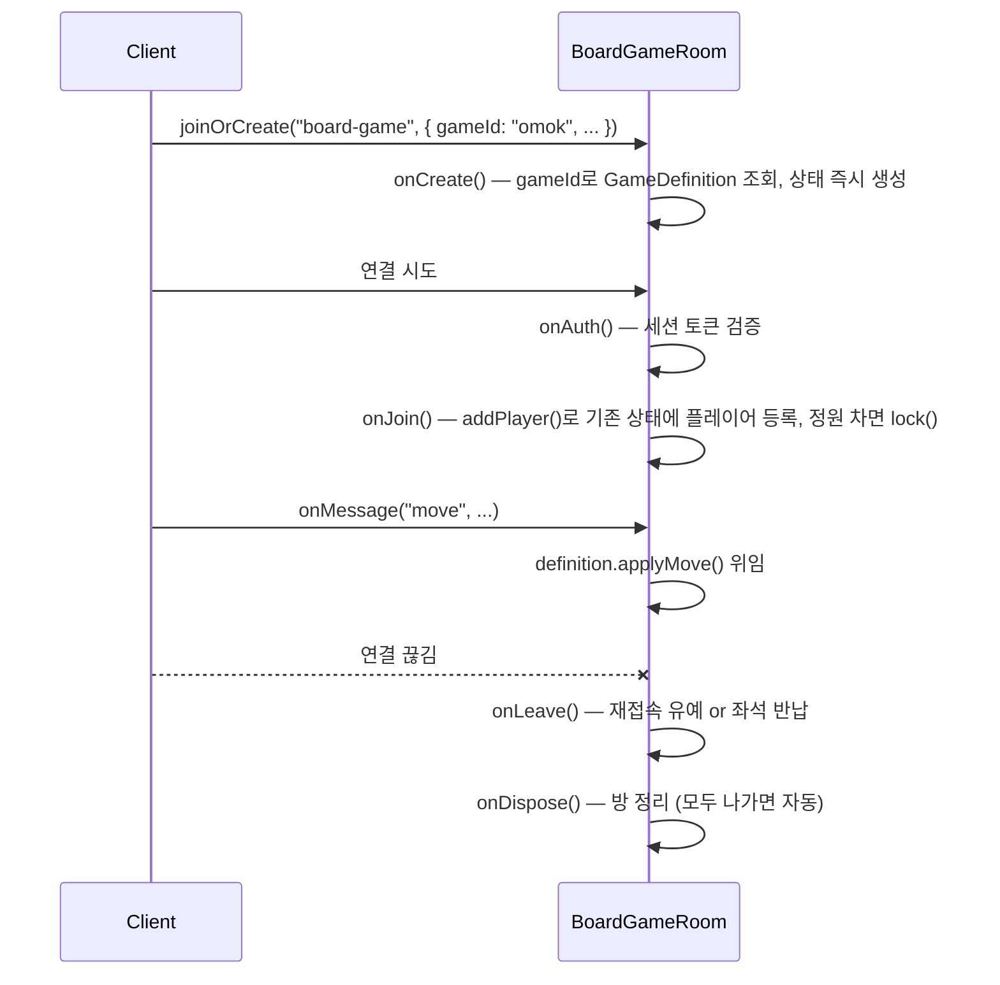
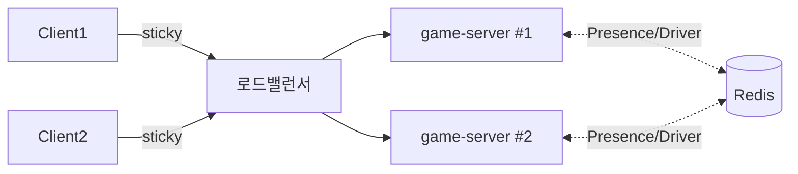
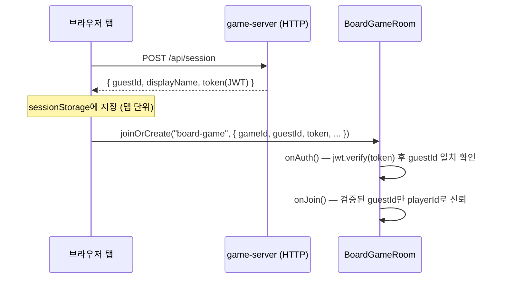
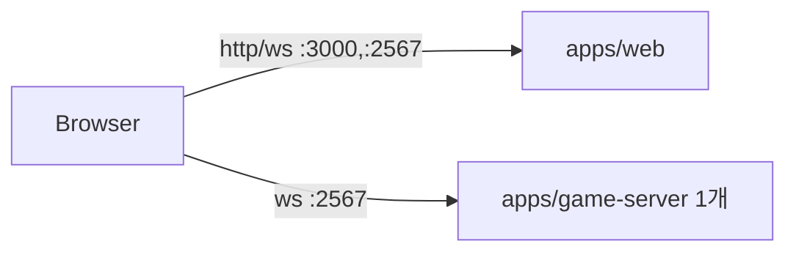
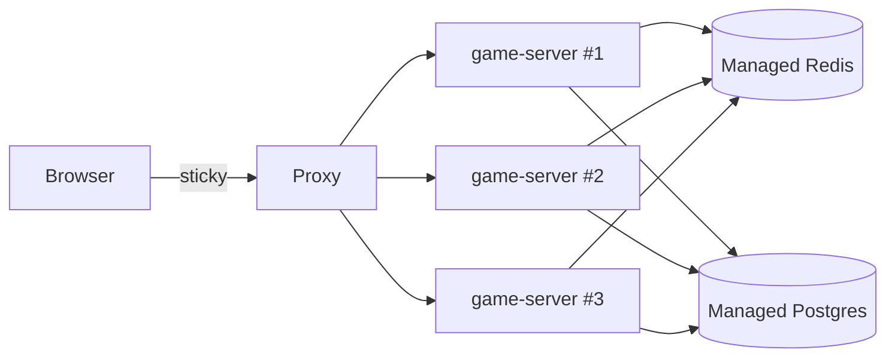

# playsalot 아키텍처 가이드

이 문서는 실시간 멀티플레이 게임 서버를 처음 다뤄보는 사람을 대상으로, 필요한 개념부터 이 프로젝트에 실제로 구현된 구조까지 순서대로 설명합니다. 코드를 아직 열어보지 않았어도 전체 그림이 그려지도록 작성했습니다.

## 목차

1. [왜 HTTP만으로는 안 되는가](#1-왜-http만으로는-안-되는가)
2. [Authoritative 서버란](#2-authoritative-서버란)
3. [Room(룸) 개념](#3-room룸-개념)
4. [상태 동기화 (State Sync)](#4-상태-동기화-state-sync)
5. [게임 플러그인 구조](#5-게임-플러그인-구조)
6. [재접속 (Reconnection)](#6-재접속-reconnection)
7. [수평 확장과 Redis](#7-수평-확장과-redis)
8. [게스트 세션 흐름](#8-게스트-세션-흐름)
9. [로컬 개발 vs 프로덕션 배포](#9-로컬-개발-vs-프로덕션-배포)

---

## 1. 왜 HTTP만으로는 안 되는가

일반적인 웹 서비스(REST API)는 "요청 → 응답" 한 번으로 끝나는 통신입니다. 클라이언트가 서버에 뭔가를 물어보면, 서버가 답하고 연결을 끊습니다. 서버가 클라이언트에게 먼저 말을 걸 방법이 없습니다.

그런데 보드게임 대전은 이렇습니다:

- 상대방이 수를 두면, **내가 요청하지 않아도** 내 화면이 즉시 바뀌어야 함
- 두 사람 다 같은 게임 상태를 실시간으로 보고 있어야 함

이건 REST로는 불가능합니다(폴링으로 흉내낼 수는 있지만 느리고 비효율적). 그래서 **WebSocket**을 씁니다 — 한 번 연결을 맺으면 그 이후로는 서버와 클라이언트가 언제든 서로에게 메시지를 보낼 수 있는 양방향 통신입니다.



이 프로젝트에서는 [Colyseus](https://colyseus.io)라는 Node.js 프레임워크가 이 WebSocket 연결 관리를 대신 해줍니다. `apps/game-server/src/index.ts`에서 `WebSocketTransport`를 붙여서 서버를 띄우는 부분이 이에 해당합니다.

## 2. Authoritative 서버란

"Authoritative(권위 있는) 서버"란, **진짜 게임 상태를 서버만 들고 있고, 클라이언트는 그걸 그대로 믿고 화면에 그리기만 하는** 구조를 말합니다.

만약 반대로 클라이언트가 "저 여기에 돌 놨어요"라고 결과만 서버에 통보하는 방식이라면, 클라이언트를 조작해서 규칙을 어기거나(예: 상대 턴에 두기, 이미 돌이 있는 칸에 두기) 승패를 조작하는 게 아주 쉬워집니다.

그래서 이 프로젝트의 흐름은 항상 이렇습니다:

1. 클라이언트는 "저는 (5,5)에 두고 싶어요"라는 **의도**만 보냄 (`room.send("move", { row, col })`)
2. 서버가 그 수가 규칙상 유효한지 검사
3. 유효하면 서버가 상태를 바꾸고, 그 결과를 모든 클라이언트에게 전파
4. 무효하면 서버가 클라이언트에게 거부 이유만 알려주고 상태는 그대로

실제 코드는 `packages/games/omok/src/definition.ts`의 `applyMove` 함수입니다. 여기서 "내 차례인가", "칸이 비어있는가", "보드 범위 안인가" 등을 전부 서버 쪽에서 검사합니다. 클라이언트(`apps/web/src/components/omok-board.tsx`)는 이 결과를 받아 그리기만 할 뿐, 승패나 유효성을 스스로 판단하지 않습니다.

## 3. Room(룸) 개념

Colyseus에서 **Room**은 "게임 세션 하나"를 나타내는 객체입니다. 두 명이 오목 한 판을 두면 그게 Room 인스턴스 하나입니다. 사람이 방을 나가고 새 판이 시작되면 새 Room 인스턴스가 만들어집니다.

이 프로젝트는 게임마다 Room 클래스를 따로 만들지 않고, **`BoardGameRoom`이라는 범용 Room 하나**로 모든 게임을 처리합니다 (`apps/game-server/src/rooms/board-game-room.ts`). Room은 이런 생명주기를 가집니다:



`onCreate`에서 하는 일은 "이 방이 어떤 게임인지" 확인하는 것뿐이고 (`gameRegistry.require(options.gameId)`), 실제 오목 규칙은 전혀 모릅니다 — 이게 5번 섹션에서 설명할 플러그인 구조의 핵심입니다.

## 4. 상태 동기화 (State Sync)

서버 상태가 바뀔 때마다 매번 전체 보드를 통째로 클라이언트에 다시 보내면 낭비입니다. Colyseus는 `@colyseus/schema`라는 라이브러리로 **상태 객체의 필드마다 타입을 등록**해서, 실제로 바뀐 값만 바이너리로 압축해서 보내는 "delta encoding"을 자동으로 해줍니다.

`packages/games/omok/src/state.ts`:

```ts
export class OmokState extends Schema {
  declare board: ArraySchema<number>;   // 15x15 = 225칸, flat 배열
  declare players: ArraySchema<string>;
  declare turnIndex: number;
  declare winnerId: string;
  declare isDraw: boolean;

  constructor() {
    super();
    this.board = new ArraySchema<number>(...Array(BOARD_SIZE * BOARD_SIZE).fill(0));
    this.players = new ArraySchema<string>();
    this.turnIndex = 0;
    this.winnerId = "";
    this.isDraw = false;
  }
}

defineTypes(OmokState, {
  board: ["number"],
  players: ["string"],
  turnIndex: "number",
  winnerId: "string",
  isDraw: "boolean",
});
```

> `@type()` 데코레이터로 필드를 표시하는 예제를 문서에서 종종 보게 될 텐데, 이 프로젝트는 일부러 **`defineTypes()`(일반 함수 호출) + `declare` 필드 + 명시적 생성자** 조합을 씁니다. 실전 트러블슈팅 사례이기도 합니다:
> - `@colyseus/schema`의 `Schema` 생성자는 각 필드마다 getter/setter 쌍을 **인스턴스 자신에게** 설치해두는데(`Object.defineProperties`), 이 setter가 실행돼야 `ArraySchema`에 인코딩용 타입 정보(`$childType`)가 붙습니다.
> - 그런데 클래스 필드 초기화 구문(`board = new ArraySchema(...)`)은 `useDefineForClassFields`가 켜져 있으면 `Object.defineProperty`로 컴파일되어, 방금 설치된 setter를 그냥 덮어써 버립니다 — 조용히 인코딩이 깨집니다.
> - 이 모노레포는 `tsc`(타입체크/빌드)와 `tsx`/esbuild(game-server 개발 서버)를 같이 쓰는데, 패키지 경계를 넘어가는 파일(예: 게임 패키지 안의 `state.ts`를 `apps/game-server`가 import)에 대해 두 도구가 tsconfig의 `useDefineForClassFields` 옵션을 서로 다르게 적용해서, 같은 코드가 `tsc`로는 되고 `tsx`로는 조용히 깨지는 상황이 실제로 발생했습니다.
> - `declare` 필드는 런타임 코드를 아예 만들지 않고, 생성자 안의 평범한 `this.board = ...` 대입문은 어떤 컴파일러 설정에서도 항상 일반 대입(`[[Set]]`)으로 처리되어 setter를 확실히 거칩니다. 그래서 이 방식이 도구/설정에 관계없이 안전합니다. **새 게임의 상태 클래스를 작성할 때도 이 패턴(`declare` 필드 + 생성자 대입 + `defineTypes`)을 그대로 따르세요.**

중요한 점: **이 상태는 서버 쪽에서 항상 "제자리에서 수정(mutate)"** 됩니다 (`state.board[index] = stone`처럼). 새 객체를 만들어서 통째로 갈아끼우면 Colyseus가 "뭐가 바뀌었는지" 추적할 수 없어서 delta encoding이 안 됩니다. `packages/games/omok/src/definition.ts`의 `applyMove`가 상태를 리턴하지 않고 인자로 받은 `state`를 직접 고치는 이유가 이것입니다.

클라이언트 쪽(`apps/web/src/components/omok-board.tsx`)은 `room.onStateChange(callback)`으로 상태가 바뀔 때마다 알림을 받아서 React 상태로 복사해 화면을 다시 그립니다. 클라이언트는 이 상태를 절대 직접 고치지 않습니다 — 고쳐봤자 다음 서버 업데이트에 덮어씌워지고,애초에 authoritative 서버 원칙(2번 섹션)에도 어긋납니다.

> 실전 트러블슈팅 사례: `room.onStateChange(callback)`은 구독 시점의 "현재" 상태로 한 번 실행되는 게 아니라, 그 이후에 실제로 상태가 바뀔 때만 콜백을 호출합니다. 그래서 6번 섹션의 재접속처럼 "이미 다 채워진, 더 이상 바뀔 일이 없는 방"에 다시 들어가면 — `onStateChange`를 구독해도 이후로 아무 변화가 없으니 콜백이 영영 호출되지 않아 화면이 빈 상태로 멈춰있는 버그가 있었습니다. 고치는 방법은 간단합니다: 구독과는 별개로, 컴포넌트가 마운트되는 즉시 현재 `room.state`로 **한 번 직접 동기화**해주는 것 (`omok-board.tsx`에서 `room.onStateChange(syncFromState)`를 등록하기 전에 `syncFromState()`를 한 번 먼저 호출). "구독 = 현재 값 + 이후 변화"라는 패턴은 Colyseus뿐 아니라 이벤트 기반 API 전반에서 자주 놓치는 부분이라 새 게임을 붙일 때도 같은 패턴을 유지해야 합니다.

## 5. 게임 플러그인 구조

이 프로젝트의 핵심 요구사항은 "게임이 계속 추가된다"는 것이었습니다. 그래서 네트워킹 코드(Room, 매치메이킹, 인증)와 게임 규칙 코드를 완전히 분리했습니다.

`packages/game-engine-core/src/game-definition.ts`에 정의된 계약:

```ts
interface GameDefinition<TState extends Schema, TMove> {
  id: string;
  displayName: string;
  minPlayers: number;
  maxPlayers: number;
  createInitialState(): TState;                                  // onCreate, before anyone joins
  addPlayer(state: TState, playerId: string): void;               // onJoin, mutates the existing state
  applyMove(state: TState, playerId: string, move: TMove): GameMoveResult;
  checkGameOver(state: TState): GameOverResult | null;

  // optional — enables "vs computer" mode, see below
  getCurrentTurnPlayerId?(state: TState): string | null;
  chooseBotMove?(state: TState, botPlayerId: string): TMove;
}
```

`GameRegistry`(`packages/game-engine-core/src/game-registry.ts`)는 `id → GameDefinition` 맵일 뿐입니다. `BoardGameRoom`은 항상 `gameRegistry.require(options.gameId)`로 정의를 꺼내 쓰고, 그 안의 함수들만 호출합니다 — 오목이든 체스든 룸 입장에서는 신경 쓸 게 없습니다.

> 실전 트러블슈팅 사례 하나 더: 처음에는 "두 번째 플레이어가 들어와서 정원이 차면 그때 `createInitialState(playerIds)`로 상태를 한 번에 만든다"는 방식으로 짰습니다. 그랬더니 먼저 들어온 플레이어(1번 플레이어) 화면은 계속 "상대방을 기다리는 중..."에서 멈추고, 나중에 들어온 플레이어만 정상적으로 게임 화면을 보는 버그가 났습니다. 원인은: Colyseus는 `this.state`를 **처음 대입하는 시점 이후에 연결된 클라이언트만** 자동으로 풀 상태 동기화 대상에 포함시킵니다. 1번 플레이어는 `this.state`가 존재하기도 전에 이미 연결돼 있었기 때문에, 나중에 `this.state = ...`로 처음 대입해도 그 갱신이 1번 플레이어에게는 전달되지 않았던 것입니다. 그래서 지금은 `onCreate`에서 (아직 플레이어가 0명이어도) 상태를 즉시 만들어 두고, 각 플레이어가 들어올 때마다 `addPlayer`로 **같은 상태 인스턴스**를 계속 고쳐 나갑니다 — 상태를 통째로 교체하는 시점 자체가 없어지므로 이 문제가 원천적으로 생기지 않습니다.

**새 게임을 추가하는 절차** (예: 체커 추가 시):

1. `packages/games/checkers` 패키지 생성
2. `GameDefinition<CheckersState, CheckersMove>` 구현 (참고: `packages/games/omok`)
3. `apps/game-server/src/config/register-games.ts`에 한 줄 추가: `gameRegistry.register(checkersDefinition)`
4. 프론트에 체커용 게임 화면을 추가하고 `apps/web/src/features/games/game-ui-registry.tsx`에 `gameId → 화면 컴포넌트`를 등록

Room, 인증, 재접속, 매치메이킹 코드는 전혀 건드리지 않습니다.

### 컴퓨터(봇) 대전

로비에서 "컴퓨터와 대전"을 누르면 클라이언트가 `joinOrCreate("board-game", { ..., vsBot: true })`로 요청합니다. `BoardGameRoom`은 게임 종류를 몰라도 되는 것처럼 **어떤 게임이 봇을 지원하는지도 몰라도 됩니다** — 그냥 `GameDefinition`에 `getCurrentTurnPlayerId`/`chooseBotMove` 두 함수가 있는지만 런타임에 확인합니다:

- `onCreate`: `vsBot`이면 실제 사람 자리를 `maxPlayers - 1`개만 요구하도록 `maxClients`를 줄여둡니다 (오목은 2인용이라 사람 1명만 기다리면 됨).
- `onJoin`: 필요한 사람이 다 모이면, 남은 자리 수만큼 `bot-0`, `bot-1`, ... 같은 가짜 `playerId`를 만들어 `addPlayer`로 등록합니다. 사람이 먼저 등록되므로 항상 사람이 선공입니다.
- 매 수(사람이든 봇이든)가 끝날 때마다 `getCurrentTurnPlayerId(state)`로 "지금 차례가 봇 id인가"를 확인하고, 맞으면 `this.clock.setTimeout(..., 500)`으로 살짝 "생각하는 척" 딜레이를 준 뒤 `chooseBotMove(state, botId)`가 고른 수를 **사람 수와 완전히 같은 경로**(`applyMove` → `checkGameOver` → 상태 동기화)로 적용합니다. 클라이언트 입장에서는 봇의 수도 그냥 서버가 보낸 상태 갱신일 뿐이라 별도 처리가 필요 없습니다.

오목의 봇 로직(`packages/games/omok/src/bot.ts`)은 완전 무작위가 아니라: (1) 지금 바로 이길 수 있으면 이기는 수를 두고, (2) 상대가 다음에 이길 수 있는 수가 있으면 막고, (3) 그 외에는 기존 돌 근처(내 돌 쪽에 더 높은 가중치) + 중앙 선호로 점수를 매겨 가장 높은 칸에 둡니다 — 동점이면 무작위로 골라서 매번 똑같이 두지 않게 했습니다. 승패 판정에 이미 있는 `checkFiveInARow`(`rules.ts`)를 그대로 재사용합니다.

새 게임에 봇을 붙이고 싶다면 그 게임 패키지에 `getCurrentTurnPlayerId`/`chooseBotMove` 두 함수만 구현하면 됩니다 — `BoardGameRoom`이나 로비 UI는 `GameCatalogEntry.supportsBot`(서버가 `!!definition.chooseBotMove`로 자동 계산)을 보고 "컴퓨터와 대전" 버튼을 보여줄지만 결정할 뿐, 코드 수정은 필요 없습니다.

## 6. 재접속 (Reconnection)

와이파이가 잠깐 끊기거나 실수로 새로고침을 했다고 게임이 바로 끝나버리면 사용자 경험이 나쁩니다. Colyseus는 연결이 끊긴 클라이언트의 자리를 일정 시간 "예약"해두는 기능을 기본 제공합니다.

`apps/game-server/src/rooms/board-game-room.ts`의 `onLeave`:

```ts
async onLeave(client: Client, consented: boolean): Promise<void> {
  if (consented) {
    this.playerIdByClient.delete(client.sessionId);
    return; // 사용자가 직접 나간 경우 — 바로 좌석 반납
  }
  try {
    await this.allowReconnection(client, 30); // 30초간 재접속 대기
  } catch {
    this.playerIdByClient.delete(client.sessionId); // 시간 초과 — 좌석 반납
  }
}
```

클라이언트는 방에 입장할 때 받은 `room.reconnectionToken`을 `sessionStorage`에 저장해두고 (`apps/web/src/lib/reconnect.ts`), 페이지가 다시 로드되면 `colyseusClient.reconnect(token)`으로 **같은 sessionId를 가진 채** 같은 방에 재합류합니다 (`apps/web/src/app/page.tsx`). 서버 입장에서는 원래 있던 플레이어가 돌아온 것과 동일하게 처리됩니다.

> `sessionStorage`를 쓰는 이유: 브라우저 탭마다 독립적이라서, 로컬에서 탭 두 개를 열어 테스트할 때 두 탭이 서로 다른 게스트/플레이어로 동작합니다. (반면 `localStorage`를 쓰면 게스트 세션은 두 탭이 항상 조회 결과가 같은 계정을 공유해서 새로고침 재접속이 아니라 자기 자신과 대전하는 상황이 됩니다.)

> 실전 트러블슈팅 사례 하나 더: 페이지를 새로고침하면 브라우저는 즉시 기존 WebSocket을 끊고 이 탭의 JS 코드도 즉시 다시 시작합니다. 문제는, 새로고침 직후 `colyseusClient.reconnect(token)`을 곧바로 호출하면 아주 가끔 서버가 "reconnection token invalid or expired"로 거부할 때가 있었습니다. 원인은 타이밍 레이스입니다 — 서버가 이전 연결의 종료(`onLeave`)를 처리하고 `allowReconnection()`으로 좌석을 "예약 대기" 상태로 돌려놓기 *전에*, 새로고침한 탭의 재접속 요청이 먼저 도착해버리는 경우가 있기 때문입니다. 그래서 `apps/web/src/app/page.tsx`의 재접속 로직은 즉시 시도 → 실패 시 300ms 후 재시도 → 실패 시 800ms 후 한 번 더 재시도, 이렇게 짧은 backoff를 두고 있습니다. 이런 레이스는 로컬(같은 머신, 같은 프로세스)에서도 발생할 수 있으므로, 재접속을 다루는 코드는 항상 "한 번에 성공 못 할 수도 있다"는 전제로 짜는 게 안전합니다.

## 7. 수평 확장과 Redis

**왜 여러 대로 늘리는 게 어려운가?** 게임 서버 인스턴스가 1대뿐이면, 그 프로세스의 메모리 안에 모든 Room이 들어있으니 문제가 없습니다. 그런데 인스턴스를 2대, 3대로 늘리면 새로운 문제가 생깁니다:

- 플레이어 A가 인스턴스 #1에, 플레이어 B가 인스턴스 #2에 접속했다면? 같은 방(Room)은 물리적으로 한 프로세스 안에서만 존재하므로, 둘 다 **같은 인스턴스로 라우팅**돼야 합니다.
- 어떤 gameId의 어떤 방이 어느 인스턴스에 떠 있는지, 인스턴스들끼리 서로 알아야 매치메이킹(`joinOrCreate`)이 정확한 인스턴스로 안내해줄 수 있습니다.

Colyseus는 이 문제를 두 가지 컴포넌트로 해결합니다:

- **Presence**: 인스턴스 간 pub/sub — "이 gameId 방 열렸어요/닫혔어요" 같은 이벤트를 서로 알림
- **Driver**: "어떤 방이 어느 인스턴스에 있는지"에 대한 공유 조회 테이블

둘 다 기본은 인메모리(단일 인스턴스 전용)지만, Redis 기반 구현체로 바꾸면 여러 인스턴스가 이 정보를 공유할 수 있습니다. `apps/game-server/src/index.ts`:

```ts
const gameServer = new Server({
  transport: new WebSocketTransport({ server: httpServer }),
  presence: REDIS_URL ? new RedisPresence(REDIS_URL) : undefined,
  driver: REDIS_URL ? new RedisDriver(REDIS_URL) : undefined,
});
```

`REDIS_URL`이 없으면 인메모리로 동작(로컬에서 `pnpm dev`로 빠르게 실행할 때), `docker-compose`에서는 항상 Redis를 연결합니다 — **지금 인스턴스가 1대뿐이어도 미리 Redis 기반으로 맞춰두면, 나중에 인스턴스를 늘릴 때 이 파일을 포함해 어떤 코드도 바꿀 필요가 없습니다.**

단, Redis만으로는 부족한 부분이 하나 있습니다: 클라이언트가 WebSocket으로 계속 "같은" 인스턴스에 붙어있어야 하므로(연결은 상태 유지형), 로드밸런서가 요청을 아무 인스턴스에나 뿌리면 안 되고 같은 클라이언트는 항상 같은 인스턴스로 보내야 합니다. 이걸 **sticky session**이라고 하며, 실제로 인스턴스를 여러 대로 늘릴 때(9번 섹션) nginx의 `ip_hash`나 `@colyseus/proxy` 같은 게 이 역할을 합니다.



## 8. 게스트 세션 흐름

계정 시스템 없이 바로 플레이할 수 있어야 하므로, "게스트 세션"이라는 아주 가벼운 임시 신원을 씁니다.



`token`은 서버가 서명한 JWT라서, 클라이언트가 `guestId`를 남의 것으로 바꿔서 보내도 `onAuth`에서 서명 검증에 실패해 거부됩니다 (`apps/game-server/src/rooms/board-game-room.ts`의 `onAuth`). 이 덕분에 게임 로직(`GameDefinition`, `BoardGameRoom`)은 "이 문자열이 게스트인지 회원인지" 전혀 몰라도 되고, 그냥 검증된 `playerId` 문자열만 다룹니다.

**나중에 로그인 계정을 추가한다면**, 바뀌는 건 `apps/game-server/src/http/session.ts`(발급 로직)뿐입니다 — 익명 UUID 대신 실제 로그인된 사용자 ID로 토큰을 발급하면 되고, `BoardGameRoom`이나 게임 패키지들은 수정할 필요가 없습니다.

## 9. 로컬 개발 vs 프로덕션 배포

**로컬 개발** (`pnpm dev`): `apps/web`과 `apps/game-server`가 각자의 포트에서 뜨고, `REDIS_URL`이 없으면 인메모리 Presence/Driver로 동작합니다. 인스턴스가 1개뿐이라 sticky session도 필요 없습니다.



**1단계 배포** (`infra/docker-compose.yml`): `web`, `game-server`, `redis` 3개 컨테이너. game-server는 여전히 1개 인스턴스지만 Redis에 연결되어 있어서 — 코드 변경 없이 인스턴스만 늘리면 다음 단계로 바로 갈 수 있습니다.

**확장 단계** (아직 미구현, Phase 3): game-server를 N개 레플리카로 늘리고, sticky session을 지원하는 프록시(nginx `ip_hash` 또는 `@colyseus/proxy`)를 앞단에 두고, Redis/Postgres를 매니지드 서비스로 교체합니다. 애플리케이션 코드는 7번 섹션에서 설명한 것처럼 이미 Redis 기반으로 짜여 있으므로, 이 단계에서 바뀌는 건 인프라 설정뿐입니다.


